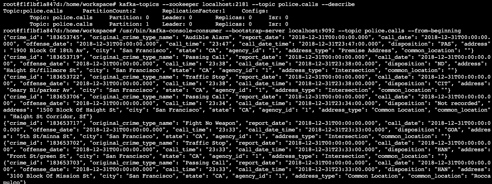
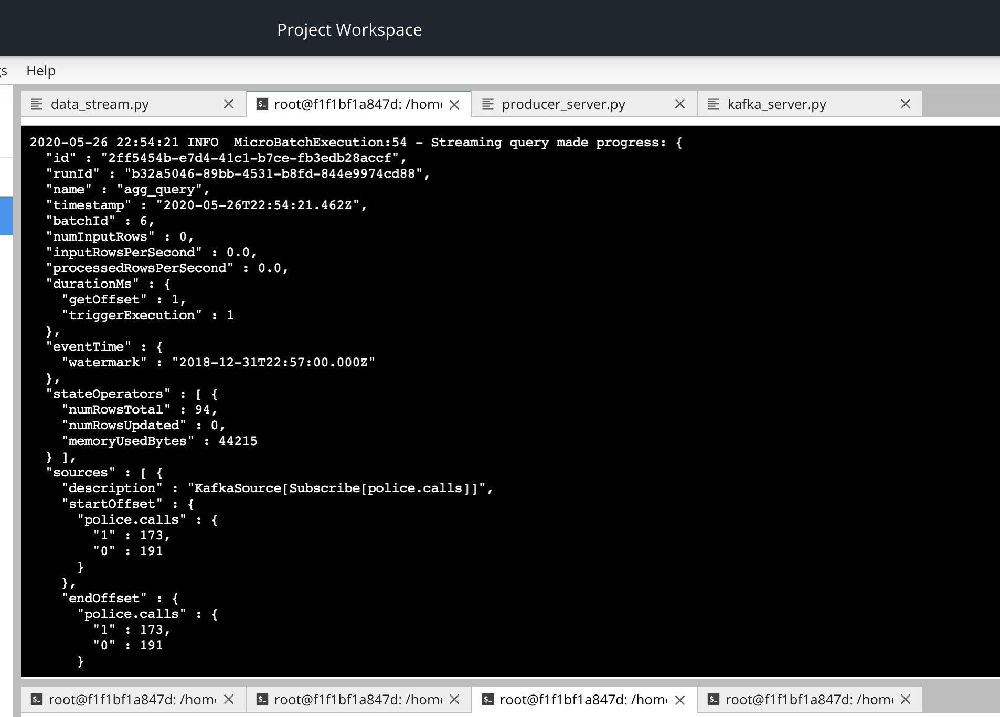
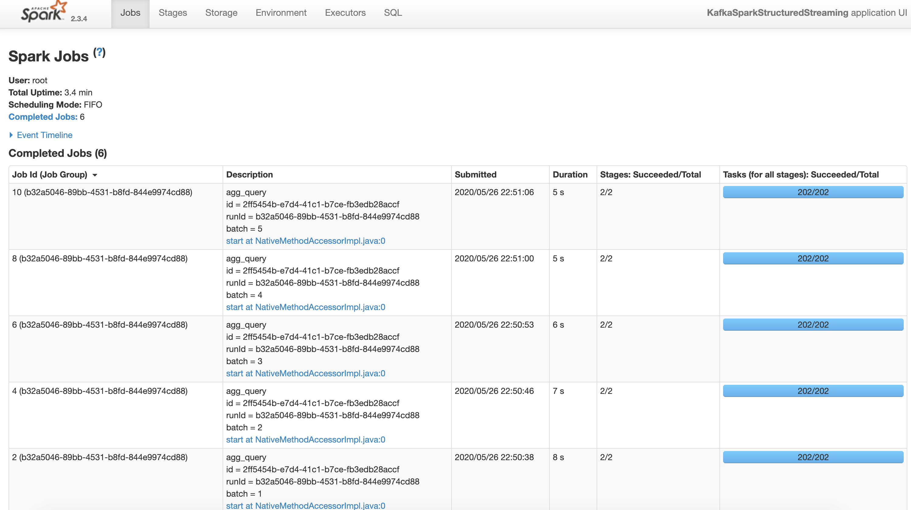

# Project: SF Crime Statistics with Spark Streaming

# Start Zookeeper and Kafka

`
zookeeper-server-start config/zookeeper.properties
kafka-server-start config/server.properties
`

# Test Kafka

`
python kafka_server.py
kafka-console-consumer --bootstrap-server localhost:9092 --topic police.calls --from-beginning
`

You'll be see:

Then Do a spark-submit with data_stream.py

`
spark-submit --packages org.apache.spark:spark-sql-kafka-0-10_2.11:2.3.4 --master local[*] data_stream.py
`

screenshot of progress reporter after executing a Spark job.

screenshot of the Spark Streaming UI as the streaming continues.

How did changing values on the SparkSession property parameters affect the throughput and latency of the data?

change processedRowsPerSecond value to higher number, that we could process more rows in second.

What were the 2-3 most efficient SparkSession property key/value pairs? Through testing multiple variations on values, how can you tell these were the most optimal?

spark.default.parallelism = Total input dataset size / partition size
spark.streaming.kafka.maxRatePerPartition
spark.sql.shuffle.partitions = Total input dataset size / partition size

set the maximum rate for each partition (maxRatePerPartition) to make the stream process running stable and efficient. 

https://spark.apache.org/docs/latest/configuration.html

https://dzone.com/articles/apache-spark-performance-tuning-degree-of-parallel